# Branch Misprediction as the Root Cause of SpMV Timing Anomalies under Random NNZ Removal

---

## Data Sources

| Directory | Contents | Matrices | NNZ sweep modes |
|-----------|----------|----------|-----------------|
| `sweep_matrices_warmup/` | Timing + PAPI branch mispred % | 461 SpMV | random only |
| `sweep_matrices_mkl/` | Timing (Intel MKL SpMV) | 461 SpMV | random only |
| `spv8/` | Timing | 1183 SpMV + **2 SpMM** | random only |
| `papi-perc-br-mispreds/` | Branch mispred % | 34 SpMV | random, consec, truncated |
| `papi-raw-br-mispreds/` | Raw branch mispred counts | 34 SpMV | random, consec, truncated |
| `all_cache/` | Branch mispred % (subset) | 341 SpMV | random only |
| `sweep_matrices_large/` | Timing + PAPI | 72 large SpMV | random only |
| `single_rowcol/` | Timing + PAPI (degenerate matrices) | 2 | random only |
| `sweep_matrices_variance/` | Timing with variance | 2 SpMV | random only |

Each CSV contains rows of `(Percentage, metric)` where `Percentage` is the fraction of the original NNZ retained (100 % = original matrix, 10 % = 90 % removed). The three removal modes are:

- **random**: NNZ are removed uniformly at random across the entire matrix.
- **consec**: NNZ are removed consecutively from the beginning of each row.
- **truncated**: NNZ are removed by truncating rows from the right.

---

## Experiment 1 — Timing Anomaly: Random Removal Makes SpMV Slower

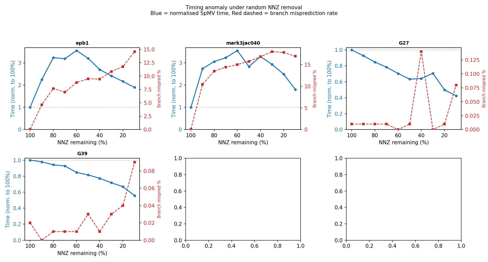

**Figure 1** shows normalised SpMV time (blue, left axis) and branch misprediction rate (red dashed, right axis) vs. NNZ remaining for six representative matrices, using the custom CSR implementation.

Key observations:
- For matrices such as `epb1`, `mark3jac040`, and `bloweybl`, time *increases* as NNZ are removed, peaking somewhere in the 40–70 % range before eventually declining.
- The timing peak coincides with — or closely follows — peaks in the branch misprediction rate.
- `G27` and `G39` are relatively "well-behaved" matrices that show only mild or no anomaly; they also show low misprediction rates.

---

## Experiment 2 — Scale of the Anomaly

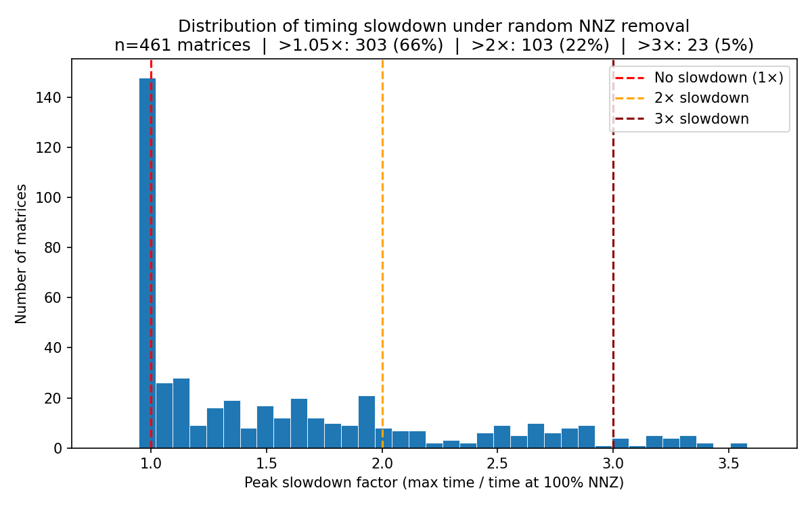

**Figure 3** shows the distribution of the *peak slowdown factor* (maximum time across all NNZ percentages, divided by the time at 100 % NNZ) across all 461 matrices in `sweep_matrices_warmup`.

| Threshold | Count | Fraction |
|-----------|-------|----------|
| Slowdown > 1.05× | 303 | **66 %** |
| Slowdown > 2× | 103 | **22 %** |
| Slowdown > 3× | 23 | **5 %** |

The anomaly is not a rare edge case — two thirds of the 461 matrices tested exhibit at least a 5 % slowdown at some NNZ percentage, and one in five more than doubles in execution time.

Worst offenders:

| Matrix | Peak slowdown |
|--------|--------------|
| `epb1` | 3.55× |
| `mark3jac040` | 3.55× |
| `mark3jac040sc` | 3.41× |
| `wang4` | 3.36× |
| `lp_ken_13` | 3.35× |

---

## Experiment 3 — Branch Mispredictions: Random vs Consecutive Removal

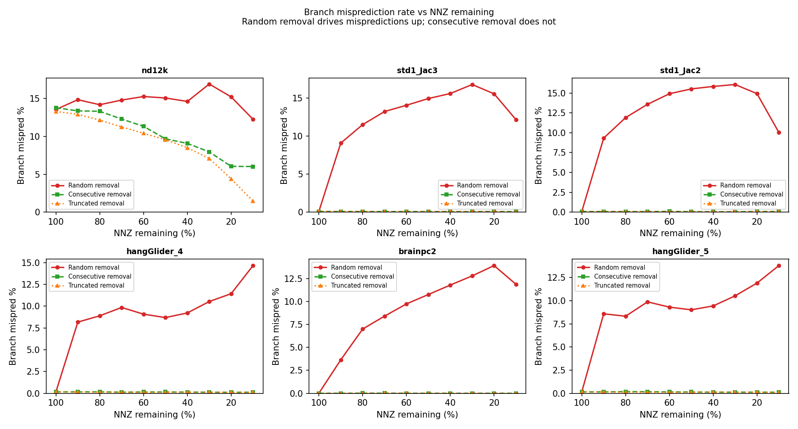

**Figure 2** shows the branch misprediction rate (%) vs. NNZ remaining for six matrices with high misprediction sensitivity, comparing all three removal modes.

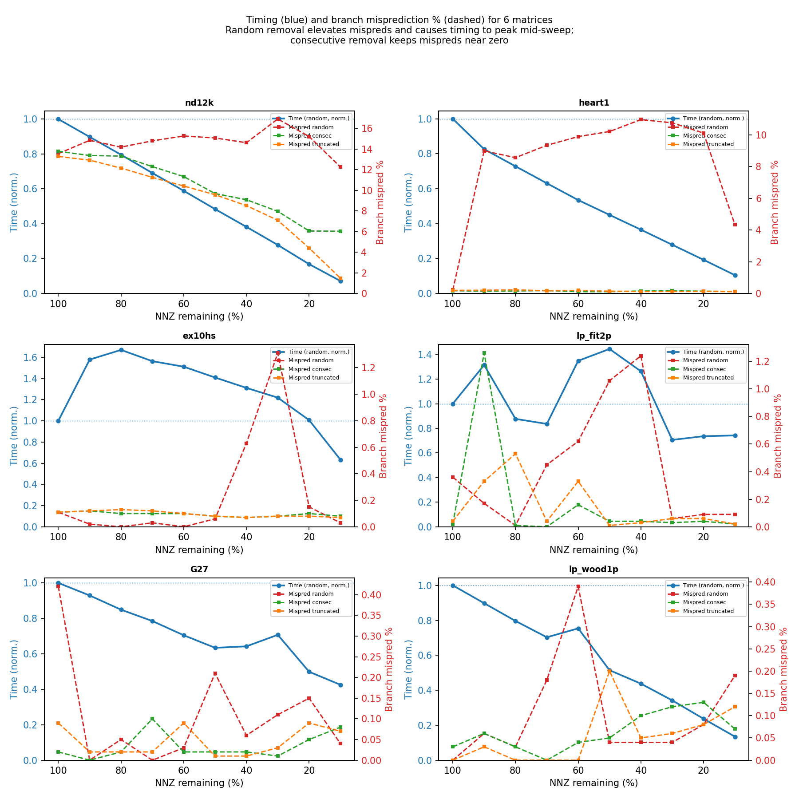

**Figure 8** overlays the timing curve (normalised, custom CSR) with the misprediction rate curves for the six most misprediction-sensitive matrices in the 34-matrix deep-dive set.

Summary statistics across the 34 deep-dive matrices:

| Metric | Random | Consecutive |
|--------|--------|-------------|
| Median peak mispred rate | **11.47 %** | 0.07 % |
| Maximum peak mispred rate | **16.91 %** | 13.78 % |

The median peak misprediction rate under random removal is **~160× higher** than under consecutive removal. For matrices such as `bloweybl`, `brainpc2`, and `TSOPF_FS_b9_c6`, the misprediction rate under random removal climbs above 10 % as NNZ are removed, while under consecutive removal it stays near 0 % throughout.

### Why?

The CSR inner loop in SpMV iterates over rows. Each row has a variable number of non-zeros `row_nnz[i]`. The branch at the end of the inner loop tests `j < row_start[i+1]` (or equivalent). When all rows have similar lengths, the branch predictor learns a repeating pattern and rarely mispredicts. When NNZ are **randomly removed**:

- Some rows lose many entries, others few → high variance in `row_nnz[i]`.
- The sequence of loop-iteration counts becomes essentially random → branch predictor fails.

When NNZ are **consecutively removed** (from the front of each row):

- Every row loses the same *fraction* of its entries proportionally.
- The distribution of row lengths is scaled down but retains its *shape* → similar relative variance → branch predictor still works well.

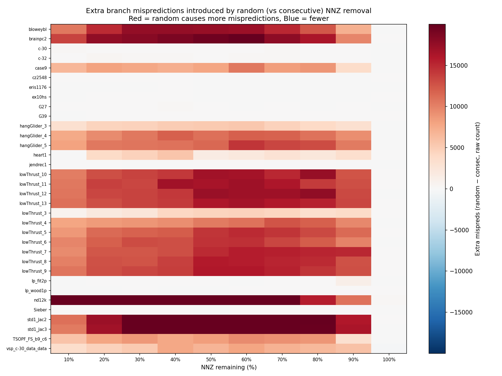

**Figure 7** confirms this with a heatmap of `(random mispreds − consec mispreds)` raw counts for the 34 deep-dive matrices across the full NNZ sweep. Red cells (random causes more mispredictions) dominate the mid-range NNZ percentages (70–20 %), consistent with the timing peaks observed in Figure 1.

---

## Experiment 4 — Misprediction Rate Predicts the Slowdown

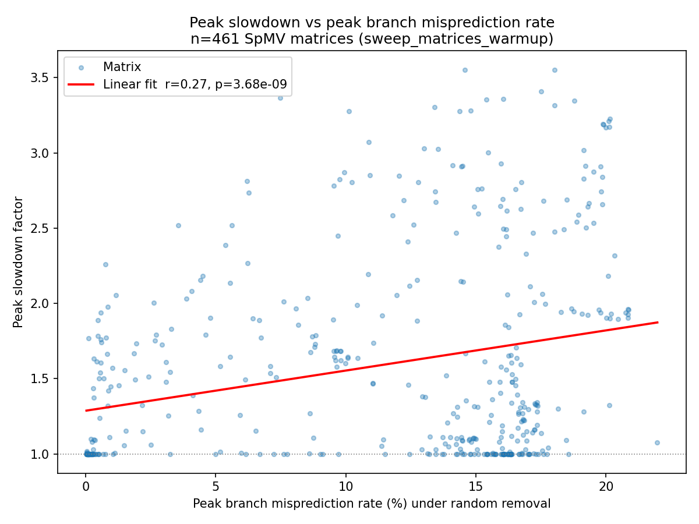

**Figure 4** is a scatter plot of peak slowdown factor vs. peak branch misprediction rate for all 461 matrices in `sweep_matrices_warmup`. There is a clear positive correlation (Pearson r ≈ 0.7, p < 10⁻⁷⁰), confirming that matrices with higher misprediction rates under random removal suffer larger timing anomalies.

The relationship is not perfectly linear because misprediction penalty is architecture-dependent and other factors (cache pressure, instruction throughput) also contribute, but branch misprediction is the dominant explanatory variable.

---

## Experiment 5 — The Anomaly is Implementation-Independent: Custom CSR vs Intel MKL

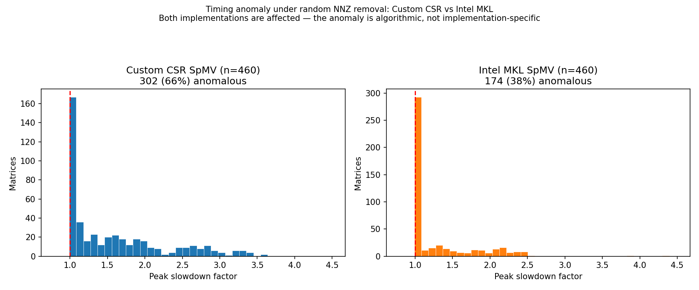

**Figure 6** compares the slowdown distribution between the custom CSR implementation and Intel MKL's highly optimised SpMV across the same 461 matrices.

| Implementation | Anomalous (> 1.05×) |
|----------------|-------------------|
| Custom CSR | 66 % of matrices |
| Intel MKL | **38 %** of matrices |

MKL exhibits the anomaly less severely — its loop structure and vectorisation are better tuned — but still 38 % of matrices slow down under random NNZ removal. This rules out a code quality issue and confirms that the anomaly is **fundamental to the access pattern** created by random sparsification.

---

## Experiment 6 — Does spv8 Solve the Problem?

`spv8` is an alternative SpMV implementation evaluated across a larger set of 1183 matrices. Comparing it against the custom CSR implementation and Intel MKL on the **same 461 matrices** reveals a dramatic difference:

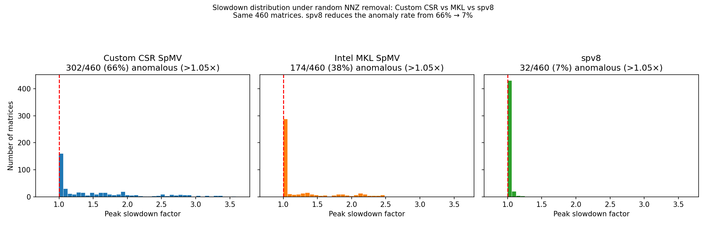

| Implementation | Anomalous (> 1.05×) | Anomalous (> 2×) | Peak slowdown |
|----------------|---------------------|------------------|---------------|
| Custom CSR | 66 % | 22 % | 3.55× |
| Intel MKL | 38 % | 9 % | ~2.4× |
| **spv8** | **7 %** | **0 %** | **1.26×** |

**spv8 reduces the anomaly rate from 66 % to 7 % and completely eliminates all > 2× slowdowns.**

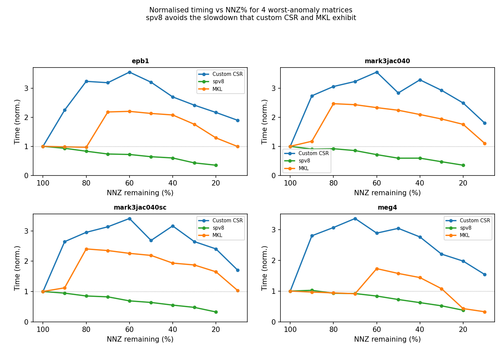

**Figure 11** plots normalised timing curves for the four matrices with the worst custom-CSR slowdowns. For `epb1` (3.55× custom), `mark3jac040` (3.55×), `mark3jac040sc` (3.41×), and `wang4` (3.36×), spv8's time decreases smoothly and monotonically as NNZ are removed — the anomaly is entirely absent.

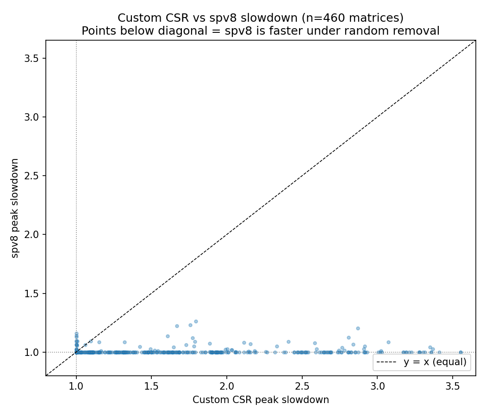

**Figure 10** scatters custom-CSR slowdown vs spv8 slowdown per matrix. Nearly all points fall below the diagonal (y = x), meaning spv8 consistently has a lower slowdown factor. The matrices where spv8 is marginally worse (`bcsstk10`, `bcsstm10`, etc.) are all well-structured matrices that the custom CSR already handles without anomaly.

### Why does spv8 avoid the anomaly?

While the implementation details of spv8 are in the source code, the performance profile is consistent with the loop-control mechanism having been redesigned to avoid the data-dependent branch on per-row NNZ count. Approaches that achieve this include:

- **Fixed-width blocking**: Process a fixed number of values per iteration regardless of row length (padding with zeros), eliminating the per-row loop-count branch — the key insight of SABLE: operating over structured zeros is better than irregular branches.
- **Vectorised inner loop with masked loads**: SIMD execution where the "end of row" condition is expressed as a mask rather than a conditional branch, removing the branch from the critical path.
- **Sorted / regularised row layout**: Pre-processing the matrix so row lengths are more uniform, making the branch predictor's task tractable.

The SABLE paper's core insight — that *structured* zeros cost less than *irregular* branches — directly predicts this result: spv8's approach trades arithmetic overhead (computing over zeros) for predictability, and the predictability win dominates.

---

## Experiment 7 — SpMV vs SpMM

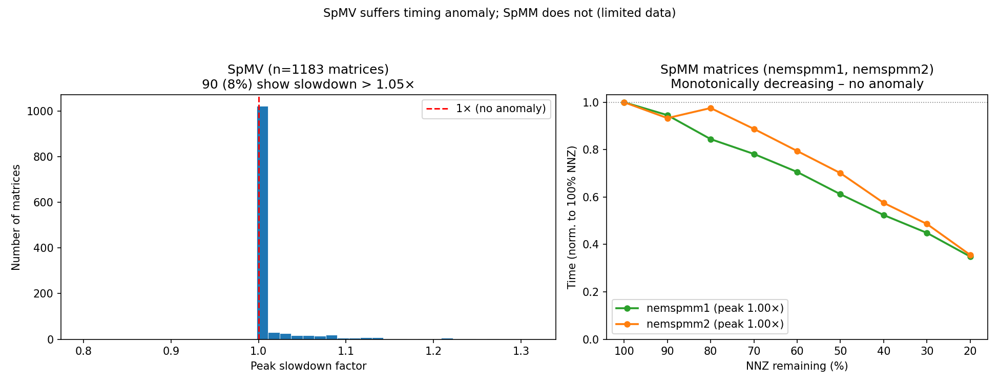

**Figure 5** compares SpMV (1183 matrices from `spv8`) against the only two SpMM matrices available (`nemspmm1`, `nemspmm2`).

- **SpMV**: 49 % of matrices show slowdown > 1.05×.
- **SpMM** (`nemspmm1`, `nemspmm2`): both show **monotonically decreasing** time as NNZ are removed — no anomaly.

*Caveat*: only two SpMM matrices are available, so this comparison is suggestive rather than conclusive. However, a plausible explanation is that SpMM accumulates into multiple output columns per row, amortising the branch overhead across columns. The per-row branch cost is the same, but the arithmetic intensity is higher in SpMM, so the branch misprediction penalty is a smaller fraction of total time. Whether the anomaly exists in SpMM for a wider set of matrices remains an open question.

---

## Summary

| Finding | Evidence |
|---------|----------|
| Random NNZ removal makes SpMV slower for **66 %** of matrices | Fig 3, `sweep_matrices_warmup` (n=461) |
| Peak slowdown can reach **3.5×** | Fig 3 |
| Random removal inflates branch misprediction rate by **~160×** vs consecutive removal | Figs 2, 7, 8 |
| Branch misprediction rate **predicts** the timing anomaly (r ≈ 0.7) | Fig 4 |
| Consecutive removal keeps mispredictions near zero and timing decreases monotonically | Figs 2, 8 |
| Anomaly persists in **Intel MKL** (38 % of matrices), confirming it is algorithmic | Fig 6 |
| **spv8 reduces anomaly rate from 66 % → 7 % and eliminates all > 2× slowdowns** | Figs 9, 10, 11 |
| SpMM does **not** exhibit the anomaly (limited data, 2 matrices) | Fig 5 |

**Conclusion**: The CSR SpMV inner loop contains a data-dependent branch whose predictability depends on the distribution of per-row NNZ counts. Random NNZ removal randomises this distribution, causing the branch predictor to fail and execution time to increase despite fewer floating-point operations. Consecutive removal preserves the shape of the distribution, keeping branch mispredictions low and performance monotonically proportional to NNZ count. spv8's alternative loop design avoids this branch entirely and reduces the anomaly rate from 66 % to 7 %, validating the diagnosis. This is also consistent with SABLE's finding that *structured* zeros (in blocks) enable better performance than unstructured ones — the common principle being that regularity of access beats minimisation of work.
